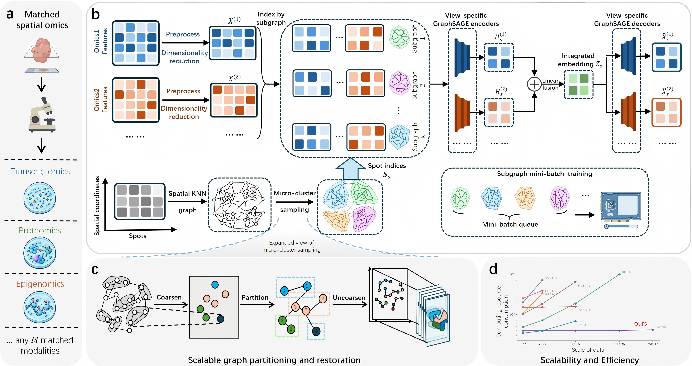

# SMAHD

SMAHD is a Python implementation for integrating two aligned spatial omics views. It builds one spatial graph shared by the views, encodes each view with a graph neural network, and learns a joint embedding for every measured spot.



## What this package does

The package takes two feature matrices that describe the same spots and returns a joint embedding. It is intended for processed spatial multi-omics features. It does not download raw data, perform raw-count preprocessing, choose the number of clusters, or impute a missing modality.

## Installation

Use Python 3.8 or newer. Install PyTorch first with the CUDA version required by your machine, then install the matching PyTorch Geometric extensions. Finally, install SMAHD from the repository root:

```bash
python -m pip install -r requirements.txt
python -m pip install -e .
```

For GPU use, the PyTorch, CUDA and PyTorch Geometric versions must be compatible. The reference environment used PyTorch 2.4.1, PyTorch Geometric 2.5.3 and CUDA 12.1. CPU execution is useful for checking a small input.

## Input file

The command expects one `.npz` file with:

| Array | Required shape | Meaning |
|---|---|---|
| `view_0` | `[N, d0]` | Features for the first omics view |
| `view_1` | `[N, d1]` | Features for the second omics view |
| `edge_index` | `[2, E]` | Zero-based source and target spot indices |

Both views must contain the same `N` spots in exactly the same order. Their feature counts `d0` and `d1` may differ. The matrices must contain finite numeric values, and `edge_index` must contain valid integer indices. Create the spatial graph before running SMAHD; the program uses the supplied graph and does not infer spatial coordinates from the feature matrices.

## Run SMAHD

Run the small example first:

```bash
python scripts/make_example.py --output example.npz
python -m smahd.cli --input example.npz --output output/example --device cpu --full-graph --epochs 2
```

Run a processed dataset on a GPU:

```bash
smahd-train --input data/processed.npz --output output/misar --profile misar --device cuda --seed 11
```

Use `--profile misar` for the MISAR configuration or `--profile tonsil` for the tonsil configuration. Use a new output directory for every run. The command refuses to overwrite an existing result directory.

## Results

The output directory contains `embedding.npy` and `metadata.json`. `embedding.npy` has one row per input spot and can be used as input to a downstream clustering or visualization method. `metadata.json` contains training information returned by the selected implementation. Partition-mode runs also create a partition cache.

Load the embedding in Python:

```python
import numpy as np

embedding = np.load("output/misar/embedding.npy")
print(embedding.shape)  # (number of spots, latent dimensions)
```

| Setting | `misar` | `tonsil` |
|---|---|---|
| Latent dimensions | 32 | 64 |
| Default epochs | 50 | 100 |
| Learning rate | 0.0002 | 0.0001 |
| Spatial / geometry weights | 0.25 / 1.0 | 1.0 / 0.05 |

These are dataset-specific presets, not universal settings for every tissue. `--epochs` changes the training budget. `--full-graph` changes the training strategy and is intended here for the small example. Batched inference retains the supplied implementation's one-hop neighborhood sampling; it is not guaranteed to equal full-graph two-layer inference.

Clustering is deliberately separate from embedding. When reproducing a reported analysis, apply that analysis' documented dimensionality-reduction and clustering settings to the saved embedding; do not treat the example's CPU output as a benchmark result.

## Tutorial

Open [`tutorials/processed_input.ipynb`](tutorials/processed_input.ipynb) after installation. It creates the same small artificial input as the command-line example and runs two CPU epochs. The notebook is intended to show the file format and output structure.

## Troubleshooting

- **CUDA is unavailable:** check `python -c "import torch; print(torch.cuda.is_available())"` in the active environment. Use CPU only for a small example if no supported GPU is available.
- **A sampling or partition extension is missing:** install PyG extension wheels compatible with the exact PyTorch, CUDA and Python versions. Installing `torch-geometric` alone may not supply them.
- **The output directory exists:** choose a new directory; do not mix separate runs.
- **The input is rejected:** check the three array names, equal spot counts, row alignment, finite values and zero-based integer edge indices.

## Contact

- Junjie Wu: w2249076497@gmail.com
- Zhihua Du: duzh@szu.edu.cn
- Xubin Zheng: xbzheng@gbu.edu.cn

## License

GPL-3.0-only. See [`LICENSE`](LICENSE) and [`NOTICE`](NOTICE).
